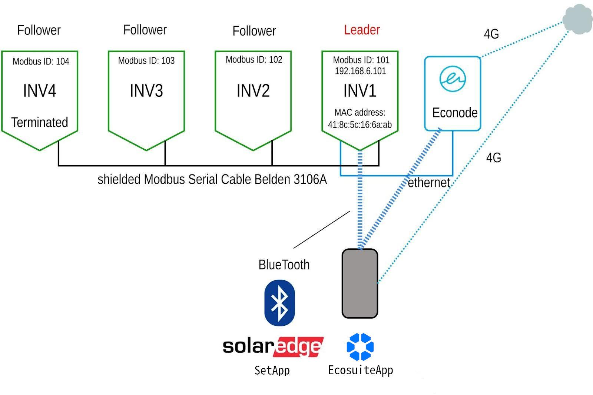

# Checklist for SolarEdge Inverter setup

Checklist for SolarEdge Inverter setup before Edge Compute Node (ECN) is installed

v2024.05.24

Overview

This checklist aims to identify all of the inverter and solar PV system requirements to be checked before the ECN is installed.

Relevant Roles for this document:

* EPC Tech
* Field Technician

Tools Needed

* Phone
* Clampmeter
* Multimeter
* Mobile Phone with Ecosuite App

Context:

Often when configuring inverters they need to be uniquely identified have the right IP numbers, Modbus IDs, names on 3rd party portals (e.g. SolarEdge, SMA Sunny Portal), sourceIds on Ecosuite, physical position in the string of inverters, and serial numbers.

Topology

The setup requires a standard SolarEdge topology whereby on its own, the N-inverter system \*(4 inverters shown here) has 1 leader inverter and N-1 followers, with the last Follower terminated as a Modbus device. In our implementation, the ECN reads over port TCP 502 the SunSpec values using Modbus TCP.

The standard following setup is needed for a SolarEdge commissioning using the topology shown below:

* Each inverter is given a unique Modbus ID starting with value 101
* One Leader inverter and the rest are set to followers
* The leader inverter is given the IP number 192.168.6.101
* Modbus TCP is enabled on the Leader and configured using port 502
* The system is fully viewable on the SolarEdge portal

Setup is accomplished using the SolarEdge SetApp software running on a smartphone, and once the ECN is installed, setup is confirmed using the Ecosuite App on the same smartphone.

.jpeg>)

**Figure 1:** _ECN is mounted left of the Inverters_

**Figure 2:** _ECN is mounted right of the Inverters_

Checklist

The following is the checklist of steps needed to be completed before the ECN is installed

| Step | Description                                                                            | Notes                                                                           |
| ---- | -------------------------------------------------------------------------------------- | ------------------------------------------------------------------------------- |
| 1    | Make sure there is one Leader inverter and N-1 Follower inverters                      | Using SetApp                                                                    |
| 2    | Make sure each inverter has a unique Modbus ID starting with 101 for the Lead Inverter | Using SetApp                                                                    |
| 3    | Record the MAC address of the Lead inverter’s ethernet port                            | Note this is not the WiFi or Bluetooth port but the wired ethernet port         |
| 4    | Fill out the Inverter Matrix details                                                   | Note layout and Serial Numbers                                                  |
| 5    | Check 4G bandwidth (bars on smartphone) standing where the ECN will be mounted         | Note whether Verizon, AT\&T, T-Mobile - as many different carriers as possible. |
| 6    | Enable Modbus TCP on port 502 on lead inverter                                         | Using SetApp It defaults to 1502, change it to 502                              |
| 7    | Update Firmware on all inverters                                                       | Using SetApp                                                                    |
| 8    | Check that data is flowing on the SolarEdge portal                                     | Using a laptop and your SolarEdge credentials as                                |
| 9    | Photograph the inverters including the space where the ECN will be mounted             |                                                                                 |

Inverters

Please fill in the serial numbers written on the side of each of the inverters, or provide a photo of each serial number with a sticker indicating the SolarEdge Inverter Name within each photo.

| Inverter Order **Left to Right** | Serial Number | Actual Serial # | Modbus ID | SolarEdge Name | Ecosuite sourceId      |
| -------------------------------- | ------------- | --------------- | --------- | -------------- | ---------------------- |
| 1                                |               |                 | 101       | Inverter1      | (Ecosuite will set up) |
| 2                                |               |                 | 102       | Inverter2      | (Ecosuite will set up) |
| 3                                |               |                 | 103       | Inverter3      | (Ecosuite will set up) |
| 4                                |               |                 | 104       | Inverter4      | (Ecosuite will set up) |
| 5                                |               |                 | 105       | Inverter5      | (Ecosuite will set up) |
| 6                                |               |                 | 106       | Inverter6      | (Ecosuite will set up) |
| 7                                |               |                 | 107       | Inverter7      | (Ecosuite will set up) |
| 8                                |               |                 | 108       | Inverter8      |                        |
| 9                                |               |                 | 109       | Inverter9      |                        |
| 10                               |               |                 | 110       | Inverter10     |                        |
| 11                               |               |                 | 111       | Inverter11     |                        |
| 12                               |               |                 | 112       | Inverter12     |                        |
| 13                               |               |                 | 113       | Inverter13     |                        |
| 14                               |               |                 | 114       | Inverter14     |                        |
| 15                               |               |                 | 115       | Inverter15     |                        |
