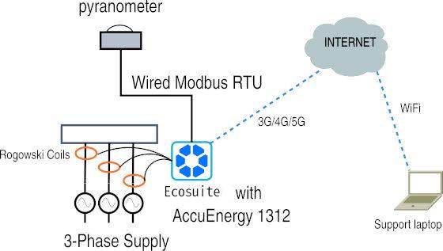

# Common Command Line commands for Edge Compute Node

Common Command Line commands for Edge Compute Node (ECN)

v2024.05.25

Overview

This document gives you some examples of the most common command line commands that field technicians will need to do during a remote SolarSSH session.

Relevant Roles for this document:

* Asset Manager
* Database Administrator

Tools Needed

* Linux laptop with SolarSSH setup and Chrome or Firefox browser
* VPN software to the 4G router used
* Credentials to the EcoNode you are maintaining
* Deployment details of the EcoNode you are maintaining
* A Hex to Decimal converter like: [https://www.rapidtables.com/convert/number/hex-to-decimal.html](https://www.rapidtables.com/convert/number/hex-to-decimal.html)

Context:

Often when dialing into a remote node, there are diagnostic commands you can run from the command line terminal that can help you understand more about what is going on with the asset.

Topology

The basic setup for this configuration is a Econode in the field which likely connects to the internet using a 4G LTE connection maintained by a linux-booting router. The Support Laptop shown in the Figure 1 diagram below represents the field technician’s computer wherever they are online with an internet connection.

**Figure 1:** _Ecosuite ECN is connected to the internet and may have multiple devices connected and CTs such as rogowski coils measuring current in a 3-Phase circuit._

Common Examples

**Restarting the solarnode service**

When making changes to a node’s configuration often you want to restart the solarnode service. This command achieves this

Sn-restart

Or

sudo systemctl restart solarnode

**Stopping the solarnode service**

sn-stop

Or

sudo systemctl stop solarnode

**Starting the solarnode service**

sn-start

Or

sudo systemctl start solarnode

**Starting a tmux session**

Starting a tmux session is something recommended before working on the node. This helps you restore where you were at if you lose the connection mid-work.

tmux

**Attaching to an existing tmux session**

If you have lost the network connection you can “attach” to that session when you reconnect to the node with:

tmux attach

**Updating software versions and restarting the solarnode service**

Often fixes or additional functionality can be added to a node with a software upgrade - this can be achieved with the command:

sudo apt update && sudo apt upgrade && sn-restart

**Installing a specific package**

Sometimes you don’t want to upgrade everything but just one package. If that package for example is the Modbus polling utility from SolarNetwork, that can be achieved using:

sudo apt update && sudo apt install sn-mbpoll

**Checking Values of Modbus registers of a kilowatt-hour meter**

Every Modbus device can be “polled” to read or even write registers using the command line. There is a list of all some samples of these devices in [Aspirational improvements to nodes](https://docs.google.com/spreadsheets/d/1ThLQOIfE2pzExo0wNrMEDHq1Rg22jElJP1g33SLtimY/edit?usp=sharing) but an example command to read the frequency register of an Accuenergy 1300 series meter is:

mbpoll -a 9 -b 9600 -m rtu -t 4:hex -P none -0 -1 -v /dev/ttyUSB\_1 -r 531

**Watching the log file**

The solarnode service creates a logfile as it runs and watching this logfile can tell you many things about the operation of a Node or DER.

sn-log-tail -f

**Checking the USB ports**

For some outages the reason is because a certain RS485 adapter has been unplugged or plugged into the “wrong” USB port. You can often see this if you run this command.

sudo ls -l /dev/ttyU\*

**Listing the USB devices plugged into USB ports**

Getting a listing of the each device that are plugged into your Edge Compute Device can be done with:

lsusb

**Installing the package for statically named USB ports on the ECN**

On older nodes you may see that the single USB port in use is /dev/ttyUSB0. We can resolve that with installing this package with the command:

sudo apt update && sudo apt install sn-pi-usb-support
