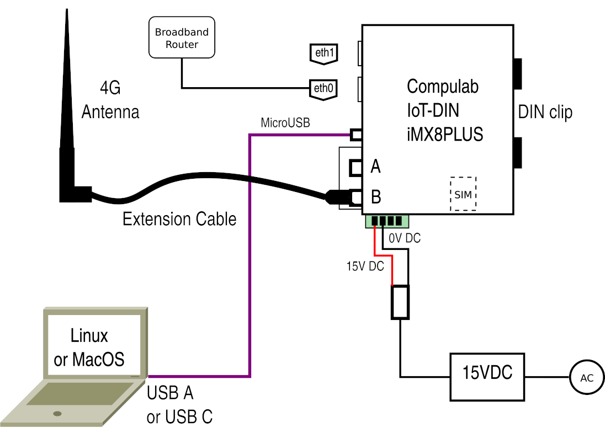

# How to Configure a 4G LTE Compulab DIN Edge Compute Node

<div align="left"><figure><figcaption></figcaption></figure></div>

_v2026.07.08_
***

### Overview

This document shows you how to take a Compulab DIN and turn it into an Ecosuite Edge Compute Node (ECN).

### Relevant Roles for this document

* Asset Manager
* Database Administrator
* Contract Manufacturer

### Tools Needed

* Linux or MacOS laptop with SolarSSH setup and Chrome or Firefox browser, and a commandline text editor like vi or nano
* A USB-A to MicroUSB or USB-C to MicroUSB cable
* Credentials to the node to upgrade
* Access to Kajeet portal and Kajeet VPN
* A Compulab DIN unit with SolarNodeOS the right 4G antenna installed and a clear access to 4G signals
* A 12VDC to 24VDC power supply
* A small flathead screwdriver
* A registered Kajeet SIM card inserted properly into the Compulab unit
* A DHCP router

### Context

When configuring a Compulab DIN device, you are starting with an ECN that already has SolarNodeOS installed on the unit (see: [_HowTo burn SolarNodeOS to the Compulab IOT-DIN-IMX8PLUS IoT Edge Gateway_](https://docs.google.com/document/d/1FLT-bLXLcKXO9Sp8CUUfu1s_9msTzSqRKaJjUqPxf_o/edit?usp=sharing))

RequiredForOnline

### Topology

With a network cable attached to the **eth0** port to a router with a DHCP address, there are ways to find the dynamically allocated IP number from the laptop on the same subnet. The other option shown here is a USB-A to MicroUSB or USB-C to MicroUSB. Set your setup like below before starting the Step By Step.



### Step-by-Step process

#### Step 1: Setup a connection to the terminal interface of the SolarNode

Open up a Terminal app and type the following to get a view of the terminal:

```
screen /dev/ttyUSB0 115200
```

Again you need to know the device that represents your USB-A to MicroUSB cable, in this case we're using /dev/ttyUSB0. But you can find it by typing:

```
ls -l /dev/tty*
```

#### Step 2: Login to the SolarNode

You should be able to get a terminal and you can log into the node with the credentials:

**User:** solar **Password:** solar

#### Step 3: Connect the SolarNode's eth0 port to an ethernet router and update the software

Note: because this update process may take time to download and install OS updates it is worth using the DHCP ethernet interface with a broadband router, rather than getting the 4G connection working and using 4G bandwidth which is generally slower and more expensive. However, you could update the OS later once you have a 4G connection, but beware that the size of the updates may be prohibitive for your 4G plan.

Use the standard apt package management to get the node up to the most recent software:

```
sudo apt update && sudo apt upgrade
sudo dpkg-reconfigure iputils-ping

sudo resolvectl dns ppp0 1.1.1.1
```

To make the DNS changes permanent upon reboot, you can check and/or edit the following file:

```
sudo nano /etc/systemd/resolved.conf
```

to make sure there is an active line that says:

```
[Resolve]
# Some examples of DNS servers which may be used for DNS= and FallbackDNS=:
# Cloudflare: 1.1.1.1#cloudflare-dns.com 1.0.0.1#cloudflare-dns.com 2606:4700:4...
# Google: 8.8.8.8#dns.google 8.8.4.4#dns.google 2001:4860:4860::8888#dns.go...
# Quad9: 9.9.9.9#dns.quad9.net 149.112.112.112#dns.quad9.net 2620:fe::fe#d...
DNS=1.1.1.1
```

This may take a while but when it is done reboot the unit:

```
sudo reboot
```

And SolarSSH back into the terminal for the SolarNode to resume the setup process.

#### Step 4: Change the OS password for this unit and document that in the appropriate credentials system

```
passwd
```

The default SolarNodeOS password is **solar**. Now pick an appropriate password of sufficient strength and follow the prompts to complete:

```
$ passwd
Changing password for solar.
Current password:
New password:
Retype new password:
passwd: password updated successfully
```

Make sure you have recorded the value somewhere secure, there is no way to recover the password. Reboot and login again to test:

```
sudo reboot
```

#### Step 5: Install the package for the Quectel EC25 internal 4G board

```
sudo apt install sn-pi-mobile-shield-usb
```

#### Step 6: Use the APN value appropriate for your SIM card

Create a new apn file. Create a symlink to that new apn file. Then edit the contents so that they correspond to the APN value given out by your carrier.

```
cd /etc/ppp/chatscripts
sudo cp apn apn.internet
sudo ln -sf apn.internet apn

# then edit apn.internet as necessary
sudo nano apn.internet
```

The following values are the one we use generally based on providers:

| SIM Provider | Carrier         | Value                  |
| ------------ | --------------- | ---------------------- |
| **Kajeet**   | Verizon         | Kajeet.gw12.vzwentp    |
| **Kajeet**   | AT\&T           | sentinelent01.com.attz |
| **Hologram** | Hologram        | hologram               |
| **Verizon**  | Generic Verizon | vzwinternet            |
| **T-Mobile** | T-Mobile        | fast.t-mobile.com      |
| **2Degrees** | 2Degrees        | internet               |
| **Spark NZ** | Spark NZ        | internet               |

Because we chose Kajeet-Verizon in this case we edited the file to look like this for example when you are using Kajeet Verizon.

```
AT+CGDCONT=1,"IP","Kajeet.gw12.vzwentp",,0,0
```

And make sure you are not including any stray extra non-visible characters that might have been included in the clipboard - only the text above. Now create an initiate file by typing the following:

```
sudo cp /etc/ppp/chatscripts/initiate /etc/ppp/chatscripts/initiate.local
sudo ln -sf initiate.local /etc/ppp/chatscripts/initiate

sudo nano /etc/ppp/chatscripts/initiate.local
```

And then insert the following content:

```
ATD*99***3#
```

And save the file. Now let's add the options file and make a symbolic link:

```
sudo cp /etc/ppp/options /etc/ppp/options.local
sudo ln -sf options.local /etc/ppp/options
```

#### Step 7: Associate the node to SolarNet

This is a standard process outlined in another HowTo document. Once you have a node id, you should be ready to test SolarSSH to that unit, connected to the internet only from 4G.

#### Step 8: Power Down, disconnect all network and USB cables from the unit locally, power cycle

Reboot the node with the command:

```
sudo shutdown -h now
```

then remove the ethernet cable from the RJ45 port of the Compulab, and remove the MicroUSB cable from the Compulab. The SolarNode should be showing no LEDs blinking. Remove power from the unit and wait 20 seconds for the capacitors to discharge. Now repower the device, and wait for 2 minutes. The Compulab should use a script to automatically connect to the internet using the ppp interface to the 4G modem. We can test this by trying to SolarSSH to that node ID.

See: [How to SolarSSH to a SolarNode](https://docs.google.com/document/d/1ybj5HESuCLQo0oOsBANxXMtTESELXe_X7qhYH4EHEdA/edit?usp=sharing)

#### Additional settings for default behavior

**Note:** The 4G connection to the internet is established at a point sometime after booting the OS, and is generally very persistent. That means that when the 4G connection drops for whatever reason - perhaps there is a storm in the area where the node is deployed, and the infrastructure for that wireless carrier or their affiliates loses power or signal strength - the SolarNode will try to reconnect.

There may be reasons for you to not want the 4G connection to initiate and connect on boot. For example, you may want to preserve bandwidth and not use up the allotted bandwidth for this SIM card's 4G plan.

You can then try connecting to the internet manually with stopping the service to auto re-connect:

```
sudo systemctl stop sn-mobile-shield-usb-reconnect.timer

Older - not used:
sudo systemctl stop sn-mobile-shield-quectel-reconnect.timer
```

This just stops the timer temporarily - for testing you can really disable the reconnect timer using:

```
sudo systemctl disable sn-mobile-shield-usb-reconnect.timer

Older - not used:
sudo systemctl disable sn-mobile-shield-quectel-reconnect.timer
```

And then making the connection manually with:

```
sudo /usr/sbin/pppd call sn-provider nodetach debug
```

Which should make a connection to the internet over the ppp interface. Later when you're ready you can re-enable the timer service with:

```
sudo systemctl enable sn-mobile-shield-usb-reconnect.timer

Older - not used:
sudo systemctl enable sn-mobile-shield-quectel-reconnect.timer
```

And restart that reconnect timer service with:

```
sudo systemctl start sn-mobile-shield-usb-reconnect.timer

Older - not used:
sudo systemctl start sn-mobile-shield-quectel-reconnect.timer
```

#### To check status of the sn-mobile-shield-usb-reconnect.timer service you can type

```
sudo systemctl status sn-mobile-shield-usb-reconnect.timer
```

### Setting up WiFi

```
sudo dpkg-reconfigure sn-wifi

sudo nano /etc/wpa_supplicant/wpa_supplicant-wlan0.conf

sudo systemctl restart systemd-networkd
```

### Setting up DHCP

Setting up one or both of the two ethernet ports on the EG500 as a DHCP server, issuing ports with a range of a subnet specified, where you can map assigned IP addresses to MAC addresses is very possible. The two RJ45 ports on the EG500 are identified as follows:

| Ethernet Port Label | Device name | Notes                                            |
| ------------------- | ----------- | ------------------------------------------------ |
| WAN                 | eth0        | LEDs will light up on this RJ45 port when active |
| LAN                 | eth1        | LEDs will light up on this RJ45 port when active |

Equally each port or both ports can be configured as DHCP clients to another DHCP server - this is generally the default of most embedded ethernet clients.

Equally each port or both ports can be configured to have static IPs on specific subnets.

#### Step 1: Edit the systemd-networkd configuration for the port

With a text editor open the configuration for the LAN device or eth1:

```
sudo nano /etc/systemd/network/10-eth.network
```

Edit the contents of this file to be:

```
[Match]
Name=eth0

[Network]
Address=192.168.6.1/24
DHCPServer=yes
IPForward=yes
IPMasquerade=both

[DHCPServer]
PoolOffset=100
PoolSize=20
EmitDNS=yes
DNS=8.8.8.8
EmitRouter=yes

[DHCPv4]
ClientIdentifier=mac

[DHCPServerStaticLease]
MACAddress=<add MAC address of the camera here>
Address=192.168.6.230

[Link]
RequiredForOnline=false
```

For the LAN port which will be eth1 you can make that just a DHCP client:

```
sudo nano /etc/systemd/network/11-eth.network
```

And give it the following content:

```
[Match]
Name=eth1

[Network]
DHCP=yes

[Link]
RequiredForOnline=false
```

And save the file. Note that the MAC address specified for the device you want to assign the IP number 192.168.6.109 should match that of the device.

#### Step 2: Restart systemd-networkd

Type the command:

```
sudo systemctl restart systemd-networkd
```

#### Step 3: edit your nftables configuration to allow for port forwarding

Edit your node's nftables configuration using this command

```
sudo nano /etc/nftables.conf
```

Make sure that the section below has the right accept parameters so like:

```
add rule ip filter INPUT counter accept
add rule ip filter FORWARD counter accept
```

To restart nftables:

```
sudo systemctl restart nftables
```

#### Step 4: Re-plugin the ethernet device you want to set as a client

You should see LEDs on the RJ45 port of the cable connected to the DHCP client device at least - this shows that the port is now active. Remember with eth1 (labeled LAN) you will not see LEDs on the RJ45 port on the EG500, where with eth0 (labeled WAN) you should see LEDs lit up on the RJ45 port on the EG500 side as well.

#### Step 5: Test to see that you can see this device as 192.168.6.109

While the package nmap will not be installed by default on your node, you can install it with:

```
sudo apt install nmap
```

And then you can use nmap to view the clients connected on that subnet:

```
sudo nmap -sn 192.168.6.0/24
```

You should see something like the following:

```
$ sudo nmap -sn 192.168.6.0/24
Starting Nmap 7.93 ( https://nmap.org ) at 2025-01-31 21:07 EST
Nmap scan report for 192.168.6.109
Host is up (0.000098s latency).
MAC Address: E4:5F:01:22:04:0E (Raspberry Pi Trading)
Nmap scan report for solarnode (192.168.6.1)
Host is up.
Nmap done: 256 IP addresses (2 hosts up) scanned in 4.36 seconds
```

Note here that the DHCP client that connected was another Raspberry Pi SolarNode (see the Raspberry Pi Trading marker) and it was assigned 192.168.6.109 as an IP number, from this DHCP server running on our EG500 following the MAC address specification.

You can check the NTP time sync status using the following command at a terminal:

```
timedatectl status
```

And you should see the following:

### Other commands

```
sudo nano /etc/ppp/chatscripts/chat-connect
```

```
sudo journalctl -f
logread -f
sn-log-tail -f
```

Other file content:

```
ABORT "BUSY"
ABORT "NO CARRIER"
ABORT "NO DIALTONE"
ABORT "ERROR"
ABORT "NO ANSWER"
TIMEOUT 30
'' AT
OK ATE0
OK @/etc/ppp/chatscripts/pin
OK '\d AT'
OK AT+CSQ
OK AT+CREG?
OK AT+CGREG?
OK AT+COPS?
OK @/etc/ppp/chatscripts/mode
OK AT
OK @/etc/ppp/chatscripts/apn
OK ATD*99#
CONNECT
```

### Setting up a USB ethernet adapter

```
sudo nano /etc/systemd/network/12-usb.network
```

```
[Match]
Name=eth1

[Network]
#DNS=192.168.3.1

[Address]
Address=192.168.3.10/24

[Route]
#Gateway=192.168.3.1
```
