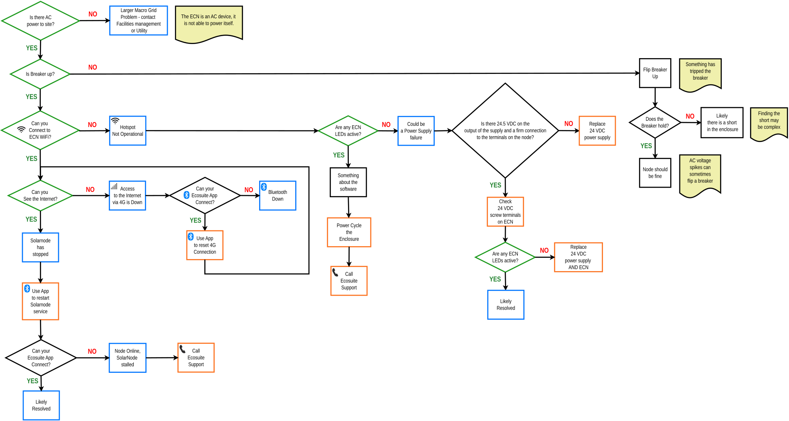

# ECN Troubleshooting Flowchart

ECN Troubleshooting Flowchart

v.2024.06.22a

**Overview:**

The ECN troubleshooting flow guides you step-by-step through power, connectivity, and software checks to restore node operation, escalating to Ecosuite Support if unresolved

<figure><figcaption></figcaption></figure>

ECN Troubleshooting Steps: Power, Connectivity, and Escalation Guide

### **1. Power & Breaker Checks** 

* **Is the breaker up?**
  * **No** → Flip breaker up.
    * If it **does not hold,** → likely a **short in the enclosure**.
  * **Yes** → proceed.
* Note: **AC voltage spikes** can sometimes flip a breaker.

### **2. AC Power & Node Status** 

* **Does the node power itself as an AC device?**
  * **No** → Something has tripped the breaker.
* **Are ECN LEDs showing?**
  * **No** → Possible **power supply failure**.
    * Check for **24.5 VDC output** and firm screw-terminal connections.
      * **No output** → Replace **24VDC power supply**.
      * If still failing → Replace **24VDC power supply AND ECN**.
  * **Yes** → proceed.

### **3. Network & Connectivity** 

* **Can you connect to ECN WiFi?**
  * **No** → Troubleshoot WiFi/network.
  * **Yes** → proceed.
* **Can you access the internet?**
  * **No** → Is access via 4G down?
    * **Yes** → Hotspot not operational.
    * **No** → Use the Ecosuite App to reset the 4G connection.
* **Yes** → proceed.

### **4. Ecosuite App Connection** 

* **Can the Ecosuite App connect?**
  * **No** → Restart **Solarnode service** in app.
  * **Yes** → Likely resolved.

### **5. Resolution & Escalation** 

* **If issues persist after the above steps** →
  * Perform a **power cycle of the enclosure**.
  * If still unresolved → **Call Ecosuite Support**.
