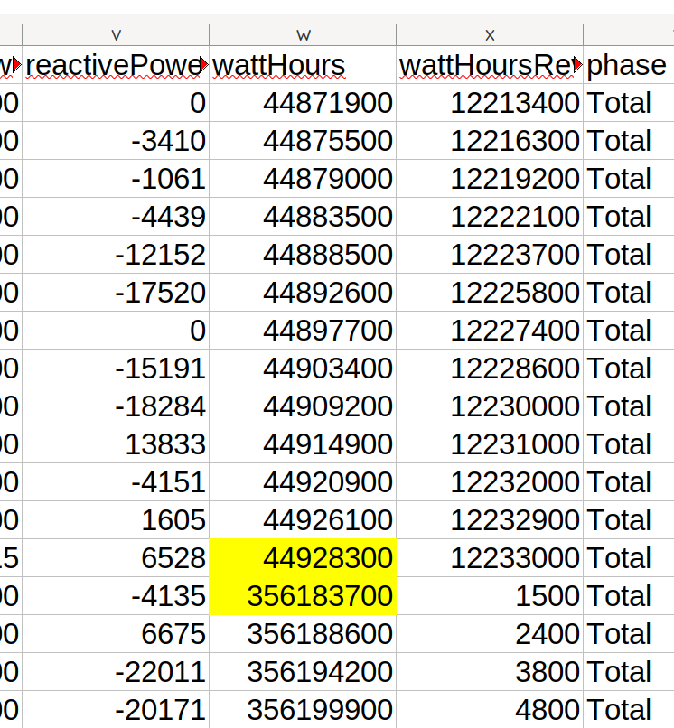

# How to fix a data spike due to a discontinuity

HowTo fix a data spike due to a kWh meter discontinuity

v2024.05.07

Aim:

This document aims to explain how resolve a data spike that emerges from a discontinuity in wattHours or iIrradianceHours

Relevant Roles for this document:

* Asset Manager
* Database Administrator

Resources needed:

* User Token access for the asset you wish to change
* Access Ecosuite for the asset where the data spike is shown
* A spreadsheet application like Excel or LibreOffice Calc
* An ASCII text editor like gEdit or Notes or Notepad
* The Data Explorer app

Context:

For different reasons due to discontinuous data streams occuring in an projects performance data, you can see “data spikes” both positive and negative in the energy charts. Some of these are because there is a hard boundary in an “accumulating” property such as wattHours or irradianceHours where the value jumps from one range (say 35000000) to a much different range of number like (23000). This can occur for example when you swap out a kWh meter that already has an unchangeable kilowattHour counter that increments as energy passes through the meter much like an odometer on a vehicle. The replacement meter might start at a different number, and as it is an accumulating property, you need to be able to accommodate a discontinuity in the data stream of this property.

There is a facility in the underlying SolarNetwork data platform called Datum Auxiliary Records that allow for this bridging of discontinuities within the time-series database. Ecosuite allows for the creation, editing and removal of such records in cases where necessary.

Step by Step Process:

**Step 1:** Identify the spike in Ecosuite

This is a straightforward use of Ecosutie to select the project and date Range via Ecosuite's interface to zoom in on the Data Spike in question.

.png>)

Step &#x32;**:** Find the discontinuity in the Data Explorer 

This is an iterative process of editing your SolarQuery to zero in on the actual datetime where you can see the discontinuity in the data. Start with a SolarQuery like:

**/solarquery/api/v1/sec/datum/list?nodeId=614\&startDate=2024-04-16T19%3A00\&endDate=2024-04-16T22%3A00\&sourceIds=/NY11/KITCH/G1/GEN/1\&offset=0\&max=65**

Where you have specified the following parameters:

| **Parameter** | **Description / Notes**                                                                                                                                                                                                      |
| ------------- | ---------------------------------------------------------------------------------------------------------------------------------------------------------------------------------------------------------------------------- |
| nodeId        | This is the node ID where the data spike is seen                                                                                                                                                                             |
| startDate     | This is the start date of the data range you want to return                                                                                                                                                                  |
| endDate       | This is the end date date of the data range you want to return - make sure it after the range you want to show/return in you CSV output, but not too far into the future as that makes for a less efficient and slower query |
| sourceIds     | This is the sourceId which has the discontinuity                                                                                                                                                                             |
| max           | This is the maximum number of records you want to return - it’s good to start small at first and then increase this number when you know you’re close to the right region.                                                   |

And make sure you can see the result as .CSV format:

.png>)

Step &#x33;**:** Copy and paste this result set into a notepad

In order to express this dataset cleanly, it often needs to be first pasted into a notepad ascii editor, to strip out any hidden chars that can confuse a spreadsheet program.

Step &#x34;**:** Copy and paste the Notepad comma separated text into a spreadsheet

.png>)

Step &#x35;**:** Identify a timestamp that lies between the two values

Once the data is in a spreadsheet, you can identify where the discontinuity exists - the highlighted area here shows how wattHours value made an abrupt jump:

Get ready to use these exact values when we create the SolarNetwork Reset event in Ecosuite. Those values correspond to:

Final Reading of the last meter: **44928300**

Start Reading of the new meter: **356183700**

And if we look at the timestamps of localtime when that occurred, it was between 3:12pm and 3:36pm which is when the kWh meter was changed.

.png>)

We now need to choose a time like 15:13pm on April 16, 2024 to set our SolarNetwork Reset event.

We will need to format that value like this in a text editor in order to paste it into the Ecosuite form:

**Apr 16, 2024 15:13:00**

**Step 6:** Create a SolarNetwork Reset event using Ecosuite

Navigate to Events for the project you are fixing, and click on Create to get the form for a new event.

Using the single date we decided that was between the two values of:

**Apr 16, 2024 15:13:00**

For both Start Date and End Date (you can ignore Due Date)

We’ll want to enter the information below in order to create the SolarNetwork Event for this example:

| Type           | Solar Network                                                              |
| -------------- | -------------------------------------------------------------------------- |
| Cause          | In this case it was a Meter swap                                           |
| Start Date     | Apr 16, 2024 15:13:00                                                      |
| End Date       | Apr 16, 2024 15:13:00                                                      |
| Node           | 614                                                                        |
| Device         | GEN/1                                                                      |
| Datum Type     | Reset                                                                      |
| Final Readings | 44928300 or the last wattHours value before the data gap                   |
| Start Readings | 356183700 or the first wattHours value of the new meter after the data gap |
| Description    | You must put a note as to why this was created                             |

.png>)

Step &#x36;**:** Wait around 10 minutes for the aggregates to be re-calculated and then check Ecosuite

Now the visualization of the day is much more sane and our data spike has been resolved.

.png>)
