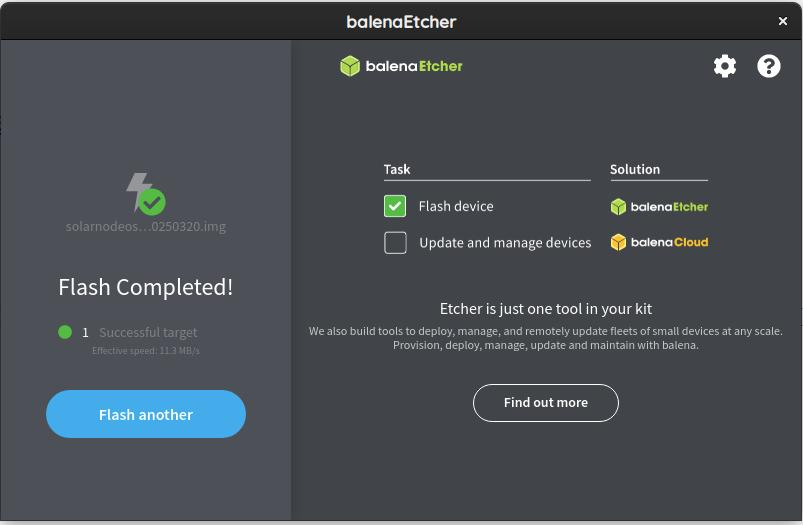
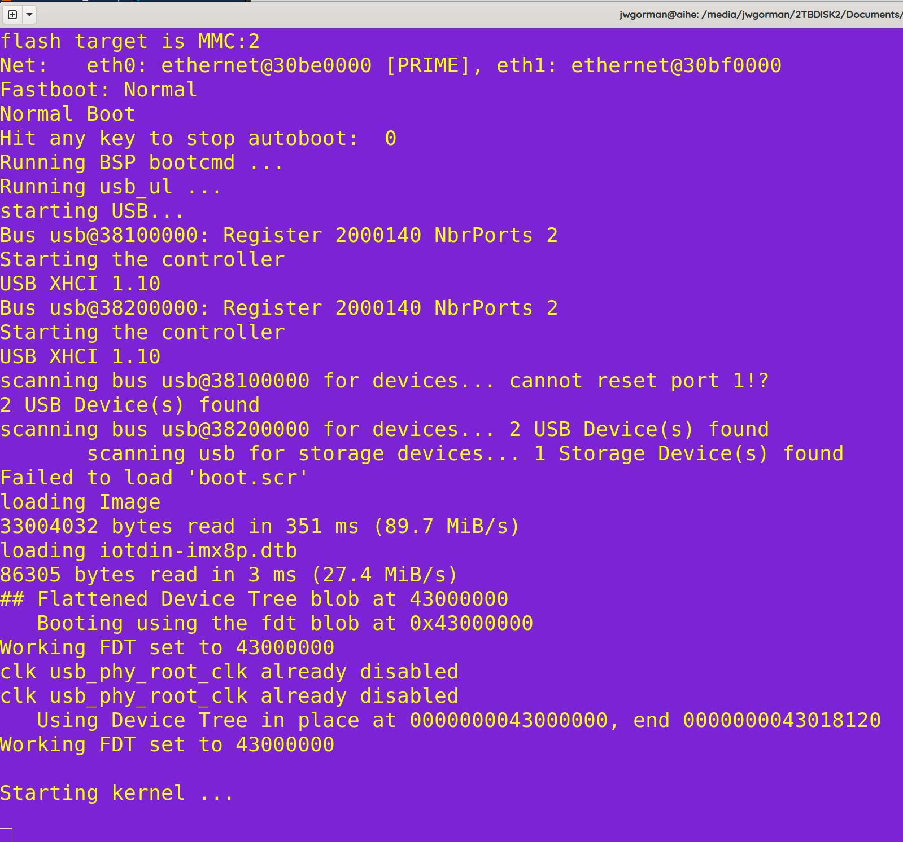
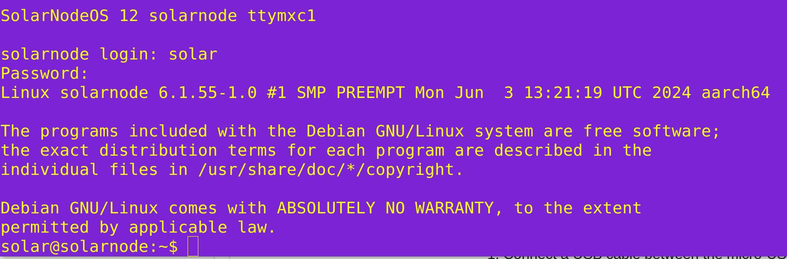
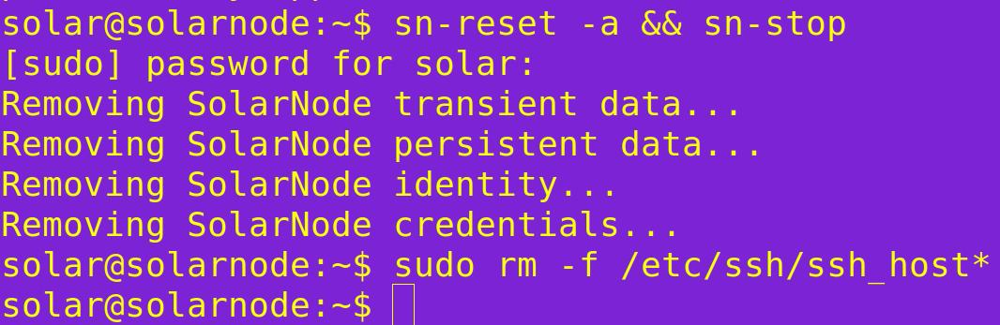
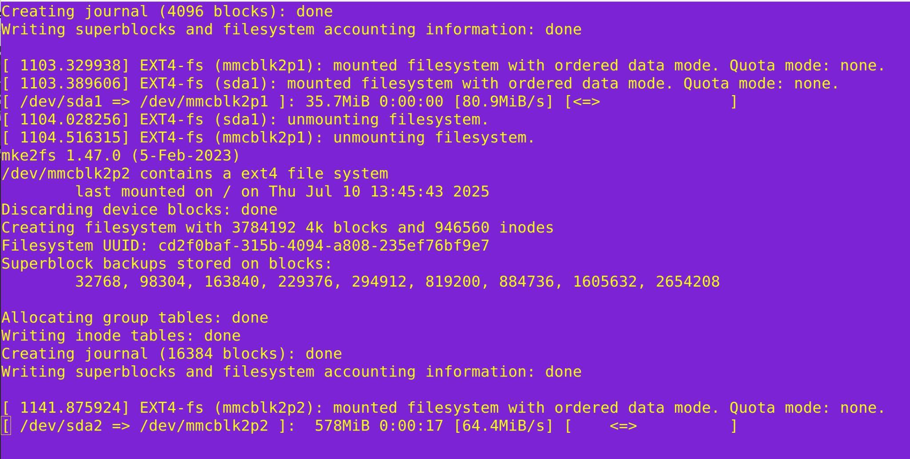
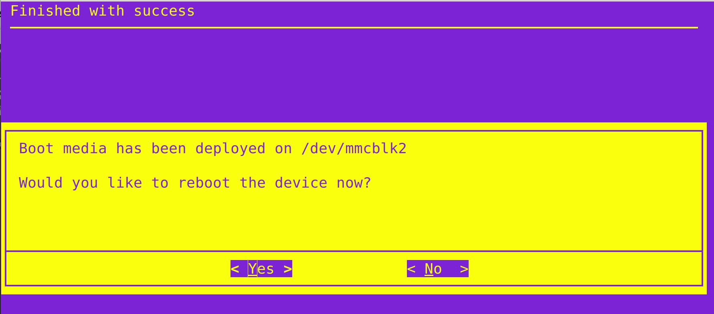
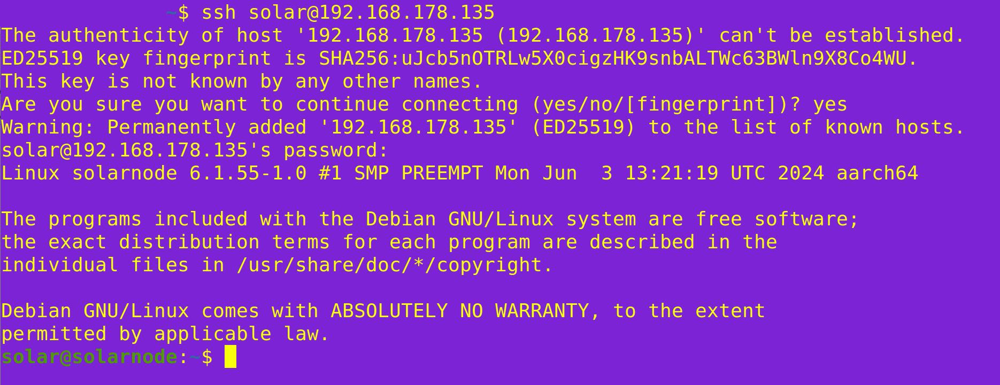
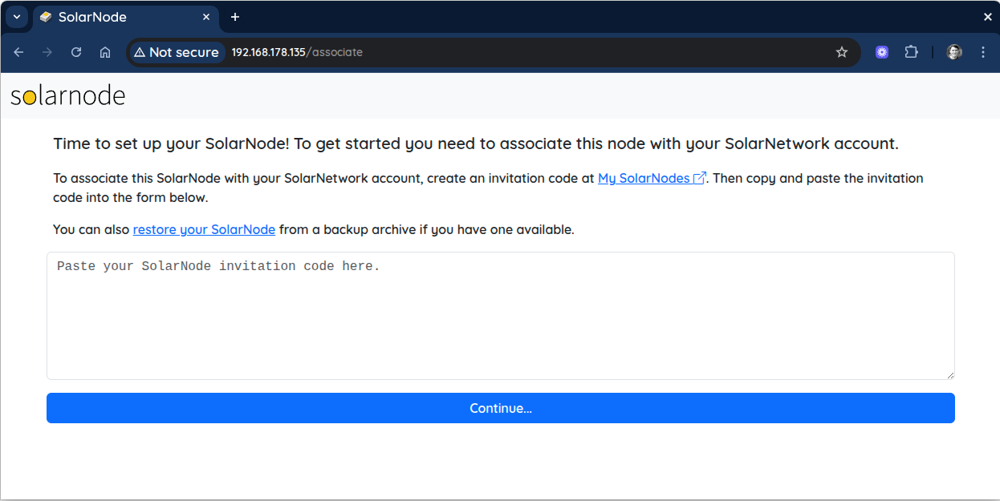

# How to burn SolarNodeOS to the Compulab IOT DIN IMX8PLUS IoT Edge Gateway

**HowTo burn SolarNodeOS to the Compulab IOT-DIN-IMX8PLUS IoT Edge Gateway**

v2025.08.04a

**Context**:

When using anIOT-DIN-IMX8PLUS IoT Edge Gateway, this document describes the steps needed to create a working bootable, “vanilla” SolarNode. Associating the SolarNode or restoring a node configuration is described in another document (TBD).

**Tools needed**:

* 7-36VDC power supply with 18AWG ferruled ends
* Compulab DIN IOTGate unit
* Compulab 4G Antenna
* USB-A Mass storage Drive (4GB or greater)
* 4G SIM Card
* Linux or MacOS Laptop with RJ45 ethernet port
* An ethernet router with DHCP
* Ethernet cable
* USB-A to USB-C cable OR USB-C to USB-C cable
* The latest IoTGATE SolarNodeOS image
* Balena Etcher app to create bootable USB drives

**Resources**:

[https://sourceforge.net/projects/solarnetwork/files/solarnode/iot-gate/](https://sourceforge.net/projects/solarnetwork/files/solarnode/iot-gate/)

* Bash terminal
* Balena Etcher
* Nmap or other network diagnostic tool
* SSH client
* Mozilla or Chrome web browser

**Diagram**:

.jpeg>)

**Step by Step process**:

**Step 1: Download the SolarNodeOS image to your laptop**

Go to the URL above to select the most recent [SolarNodeOS](http://solarnodeos.xz/) file like:

solarnodeos-deb12-iotdin\_imx8p-2GB-20250320.img.xz

Note you can use the SHA256 file to verify its authenticity.

cd /\<directory where the .xz image and .SHA256 file is>/

sha256sum --check solarnodeos-deb12-iotdin\_imx8p-2GB-20250320.img.xz.sha256

**Step 2**: Using etcher, burn the image to the USB drive

This process follows is a pretty straightforward wizard of choosing the image and the target device:

.jpeg>)

.jpeg>)

.jpeg>)

.jpeg>)

You now have a bootable SolarNodeOS USB drive.

**Step 3**: Connect a USB-A to MicroUSB cable on your laptop to the MicroUSB port of the IOT-DIN-IMX8PLUS IoT Edge Gateway

You can verify the identifier of the USB drive on your laptop using the command:

sudo ls -l /dev/ttyU\*

And you should see a device like:

crw-rw---- 1 root dialout 188, 0 Aug 4 00:36 /dev/ttyUSB0

This device, /dev/ttyUSB0 is what you will use in Step 5

\
**Step 4**: put the Bootable USB Drive into the USB-A port on the IOT-DIN-IMX8PLUS IoT Edge Gateway

This bootable USB Drive contains the media to install SolarNodeOS onto the eMMC media internal to the IOT-DIN-IMX8PLUS IoT Edge Gateway, but we don’t want to power it up quite yet.

**Step 5**: Connect to the USB cable using the following command in a Terminal

sudo screen /dev/ttyUSB0 115200

You should see a blank screen for now - that is where the boot sequence will happen.

**Step 6**: Power the device using V+ and V- terminals and power up

Read the IOT-DIN-IMX8PLUS IoT Edge Gateway manual to locate the DC power terminals but they are at the bottom of the device.

.jpeg>)

You should see in the terminal a boot sequence underway - this is like plugging a monitor into the IOT-DIN-IMX8PLUS IoT Edge Gateway

**Step 7**: Login to the SolarNodeOS instance booted from the USB Drive

The credentials are the default ones:

User: solar

Password: solar

And you will now be at the command prompt of SolarNodeOS booted from the USB Drive. We need to now flash the eMMC media which is the internal boot drive of the IOT-DIN-IMX8PLUS IoT Edge Gateway.

**Step 8**: Reset and prepare the device for flash

We need to both reset this unit and stop any solarnode service from running. Type the command:

sn-reset -a && sn-stop

And it will ask you for your password - once again this is:

solar

Also let’s remove any ssh host keys so they are not copied to the eMMC file system:

sudo rm -f /etc/ssh/ssh\_host\*

**Step 9**: Flash the eMMC of the IOT-DIN-IMX8PLUS IoT Edge Gateway

Type the command:

sudo cl-deploy

**Step 10**: Choose the device you want to flash - there is only one choice

You will only see one choice (the internal eMMC media) but use the Space bar to select it:

.jpeg>)

Now Selected (\*):

.jpeg>)

Use the TAB key to move to \<OK> and hit Return

**Step 11**: Confirm you will be destroying anything currently written on the eMMC of the IOT-DIN-IMX8PLUS IoT Edge Gateway

.jpeg>)

TAB to the \<Yes> button and hit Return. The process will then begin for formatting and replacing the OS with the one from the USB Drive and you will see status of this process happening:

After a short time it will be complete so get ready to remove the USB Drive:

Tab to the \<No> button and hit it with an Enter key, which will exit you to the commandline prompt.

**Step 12**: Shutdown the SolarNode, remove the USB Drive and Power cycle the device

At the command prompt type:

sudo shutdown -h now

And the IOT-DIN-IMX8PLUS IoT Edge Gateway will fully power down, with no LEDs lit. Remove the USB Drive from the USB-A port. Now power cycle the unit - it will reboot from the eMMC internal media and you will see LEDs begin to blink again.

**Step 13**: Plug an ethernet cable connected to your router into the port labeled ETH0 and find it on your LAN as host named solarnode

The SolarNode will receive an IP address by DHCP by default, so will join your lan as a host called solarnode. With a utility like nmap for example, you can find all the devices named solarnode on a LAN with a subnet 192.168.178.0 with the command:

sudo nmap -sn 192.168.178.0/24 | grep solarnode

And it should return something like:

Nmap scan report for solarnode.fritz.box (192.168.178.135)

And you can the ssh to the new node using:

ssh solar@192.168.178.135

Using the same default credentials

solar/solar

And you can see the web interface in this case at:

[http://192.168.178.135/](http://192.168.178.135/)

