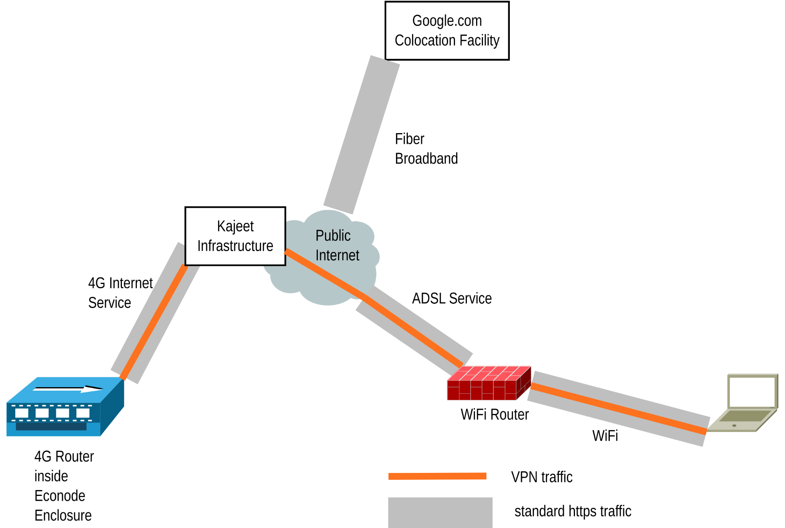
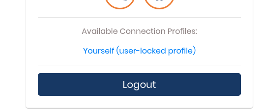
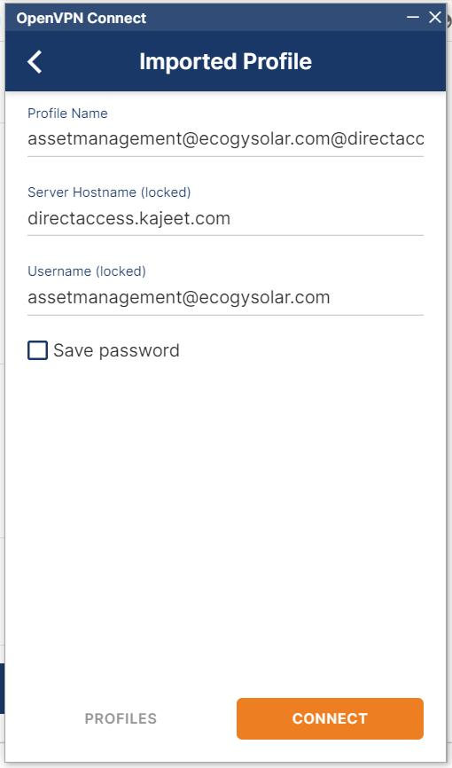
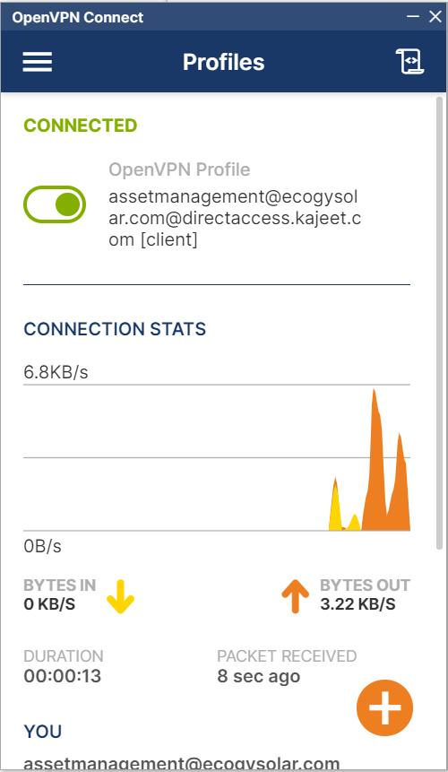
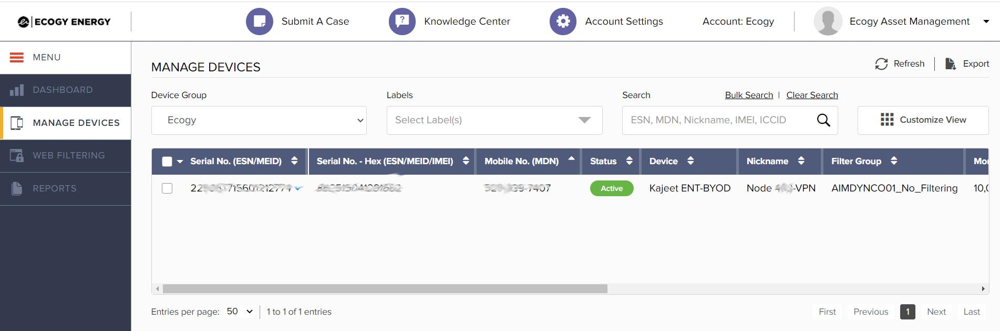
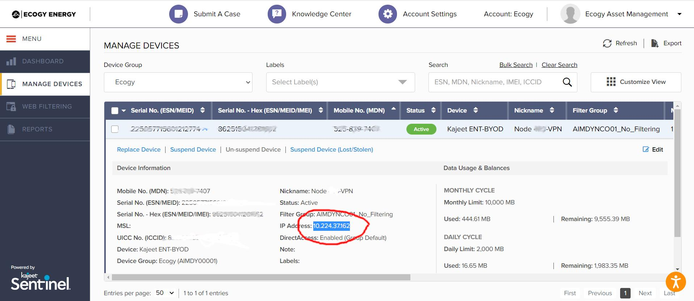
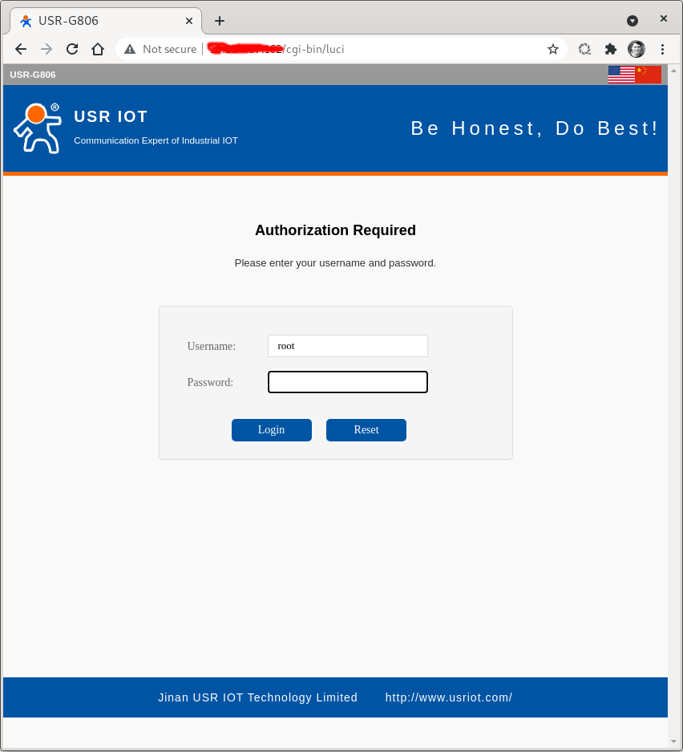
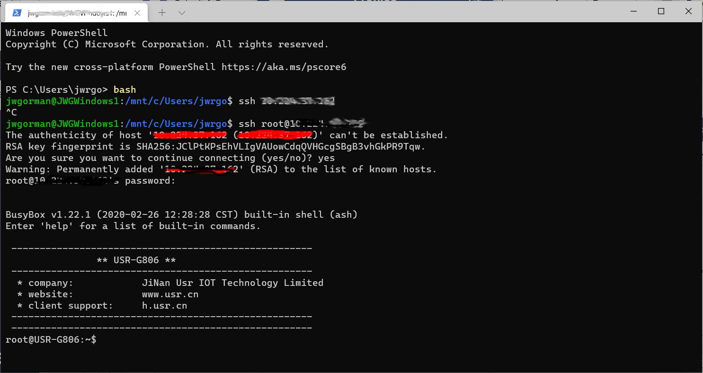
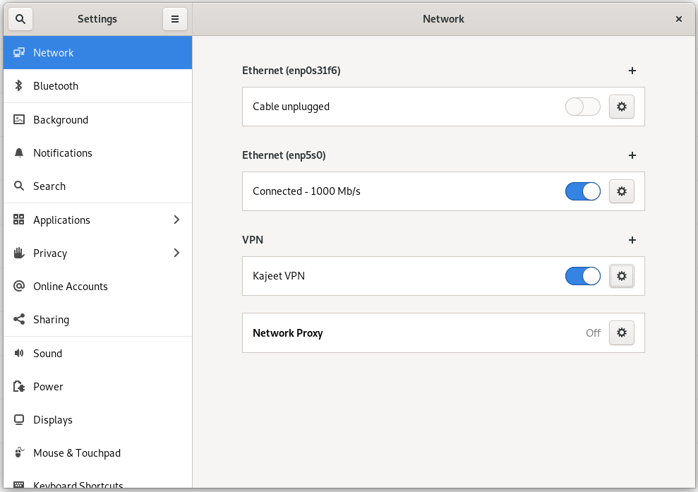

# How to establish a connection on Kajeet VPN

How to establish a connection on Kajeet VPN

v.2025.08.23a

Overview:

This document will describe how to use Kajeet’s Verizon-based VPN to access a 4G router and an Econode securely.

Tools and Information required:

* Windows or Linux Laptop with Chrome, Firefox, or Safari browser and SSH command line
* Credentials to Kajeet

Links:

Ecogy’s Kajeet dashboard:

[https://sentinel.kajeet.com/auth/login](https://sentinel.kajeet.com/auth/login)

Ecogy’s Kajeet downloads:

[https://directaccess.kajeet.com/](https://directaccess.kajeet.com/)

OpenVPN for Windows:

[https://openvpn.net/client-connect-vpn-for-windows/](https://openvpn.net/client-connect-vpn-for-windows/)

Physical Topology:

Diagram 1: Virtual connection to an Ecogy 4G router and hosts

What a VPN achieves is a “tunnel” of secure traffic to your remote host that uses the standard public internet for transport.

Step-by-Step procedure

**Step 1**. Log in to [Kajeet Downloads](https://directaccess.kajeet.com/)

Click on the link above and navigate to the bottom of the screen to save the client.ovpn file - to do this, click on the link titled ”Yourself (user-locked profile)” shown below. This will download the file that contains all the settings and certificates (but not the credentials) to authenticate you on the Kajeet VPN.

\
It will save to your computer (normally in the Downloads folder by default) as a file called client.opvn You will need this file to make your OpenVPN client software connect properly.

**Step 2**. Download the VPN software for your computer

On Windows, download the .msi installer file from the link above and install it.

On Linux, search software for

**Step 3**. Import the client.ovpn file

At the end of installation, it will run the OpenVPN Client Connect program and will ask you to import your VPN settings. You can choose the file or just drag the file onto the application, and it will import it:

**Step 4**. Click the Save Password checkbox and use the credentials you use to connect to the Kajeet dashboard. You should be able to connect to form a secure VPN, and then you will see a screen like this:

**Step 5**. Get the public IP number of the device you want to connect to

Now that you have a VPN established, go to the Kajeet Dashboard, log in with the correct credentials, and go to Manage Devices:

Click on this device to get the details of the device (which will also include the IP address of that device)

**Step 6**. Copy and paste the IP number into a browser

If you point a browser at this IP you should get the Web interface of the USR router like this:

**Step 7**. SSH to the router

Using a Windows Terminal command prompt, type:

ssh root@\<that same IP number that you just found>

**On Linux**:

On the Gnome Desktop, you can enable openvpn by using the commands:

sudo apt update

sudo apt upgrade

sudo apt install openvpn network-manager-openvpn-gnome

Then, when you go to your Network Settings, there’s a VPN option you can configure - you need to import the client.opvn file (see [Step 1](how-to-establish-a-connection-on-kajeet-vpn.md#dxv233djop7w) above), and set the user and password credentials, and give the VPN a name. After that, you’ll have a toggle to enable or disable the VPN. You can then use browsers and terminal prompts for http and ssh access to remote devices.

Note that when enabled, the VPN can make other apps like Slack not work temporarily due to networking.

