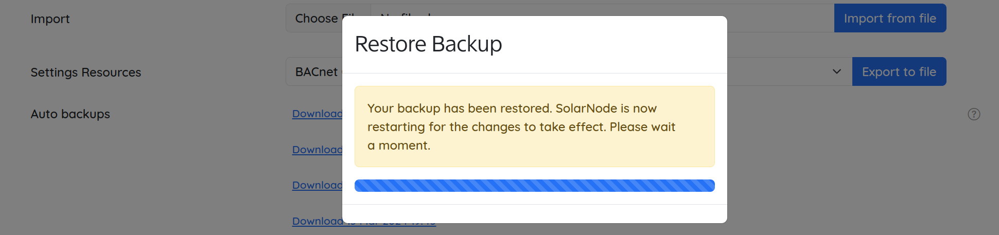

# How to upgrade your node's embedded database from Derby to H2

HowTo upgrade your node's embedded database from Derby to H2

V2024.04.26

Video Link:

[https://www.loom.com/share/4e12ae4a2fae4581bdc5a9a0af5fc69d?sid=c3d7591b-e786-493e-b441-3e7f4db1f96f](https://www.loom.com/share/4e12ae4a2fae4581bdc5a9a0af5fc69d?sid=c3d7591b-e786-493e-b441-3e7f4db1f96f)

Aim:

This document aims to explain how to upgrade your node’s database from Derby to H2

Relevant Roles for this document:

* Asset Manager
* Ecosuite Linux Engineer
* Contract Manufacturer

Resources needed:

* Linux, Mac, or Windows 10 or 11 Laptop with SSH
* Econode with credentials to OS and GUI
* Remote access and credentials to the Linux-based 4G router used by the SolarNode
* Ability to SolarSSH into a remote Econode

Context:

Solarnode, the service that runs on a Single Board Computer (SBC) known as a SolarNode, uses an embedded database to hold configuration details and cached sourceId data before it posts it to SolarNet. The older version of the database was Derby and at a certain point, a more modern and capable embedded database was used, called H2. By completing this step, a working SolarNode will be no different from when you started, except for the fact that the performance of the unit will be improved.

The main advantages of upgrading a SolarNode’s embedded database to H2 is the one-time performance gain of the web interface when administering a fleet of SolarNodes, and bringing your fleet into the most standard use cases of how fleets of SolarNodes are managed. While legacy software is still supported, at some point, an older configuration that has not been updated for many years could have untested differences that could add time to management tasks.

Step-by-step process:

**Step 1:** SSH to the SolarNode you want to semi-permanently

You can do this via the command line or the SolarSSH app.

**Step 2**: Confirm that the node you are logged into is the one you want to upgrade

Click on Settings…Certificates

.png>)

**Step 3:** Make a full backup of your configuration

Using AWS S3 as a repository is the best way to manage the backups of your nodes’ configurations. Go to Settings and click Backup Now to make a backup, and note the time when you did this step.

**Step 4:** Check that you do indeed have a Derby-based node to upgrade

If you type at the command line:

**sudo ls -l /var/lib/solarnode/app/main/\*derby\***

It should return a file listing containing JAR files that reference Derby, like:

**-rw-r--r-- 1 solar solar 34320 Mar 8 2023 /var/lib/solarnode/app/main/net.solarnetwork.node.dao.jdbc.derby-3.0.0.jar**

**-rw-r--r-- 1 solar solar 2003 Jul 26 2022 /var/lib/solarnode/app/main/net.solarnetwork.node.dao.jdbc.derby.ext-1.1.2.jar**

**Step 5:** Pause the SolarNode service 

To stop the SolarNode service on the device, do:

**sudo systemctl stop solarnode**

Or you can use the command:

**sn-stop**

**Step 6:** Install the H2 infrastructure package

**sudo apt install solarnode-app-db-h2**

**Step 7:** Start the solarnode service again with:

**sn-restart**

or

**sudo systemctl start solarnode**

**Step 8:** Wait for the node to start up

To watch the SolarNode service start up, you can watch the log file with the command:

**sn-log-tail -f**

And you will see the service run through the motions of setting everything up for persistence and transport to SolarNet. This may take a few minutes.

**Step 9**: In your browser, log back into the SolarNode UI.

Use the same credentials for the web interface that you used to.

**Step 10**: Go to **Settings > Backups** and restore your backup.

Remember that you want to restore the same nodeId and the most recent backup that you just made. The timestamps of the ones listed should include the one made just now when you noted the time of the backup. That is the backup to choose from the list, and click the Restore button. It will give you a checklist of all the parts of the backup that you can restore.

You can **un-check** things like _Certificates_, _Plugins_, and _WiFi settings,_ as those will not need restoring.

.png>)

It should then do the restore process and show you confirmation that the configuration was restored:

**Step 11**: Log back into the web interface to confirm settings

As SolarNode starts up again, the node should behave just like before, but be a bit more responsive during SolarSSH sessions. To confirm that you have upgraded, you will not see any derby .jar files when you reissue the command:

**solar@solarnode:\~ $ sudo ls -l /var/lib/solarnode/app/main/\*derby\***

**ls: cannot access '/var/lib/solarnode/app/main/\*derby\*': No such file or directory**

But you _will_ see one when searching for h2:

**solar@solarnode:\~ $ sudo ls -l /var/lib/solarnode/app/main/\*h2\***

**-rw-r--r-- 1 root root 16302 Dec 17 17:37 /var/lib/solarnode/app/main/net.solarnetwork.node.dao.jdbc.h2-2.0.1.jar**

You’ve successfully upgraded your node infrastructure!
