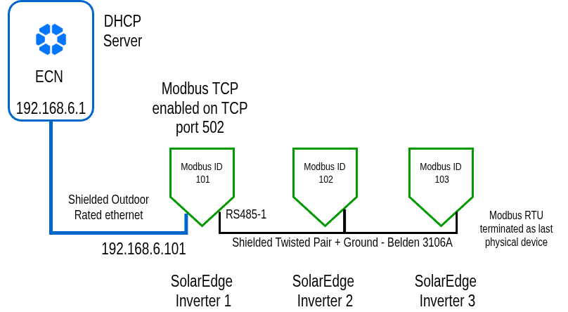

# HowTo Confirm your SolarEdge Setup is Valid

**Version:** v2026.06.03

***

## Aim

This document explains how to make sure your SolarEdge network setup is valid before leaving site.

***

## Relevant Roles

* EPC or O\&M technician
* Asset Manager
* Contract Manufacturer

***

## Resources Needed

* SetApp from SolarEdge
* Contact Info for Ecosuite Support

***

## Context

When setting up an ECN to talk with a bank of SolarEdge inverters, the best way to connect to those inverters is to use Modbus TCP to the first physical SolarEdge inverter, and let that inverter provide a conduit to the other SolarEdge inverters which are connected by RS485 and using Modbus RTU.

This is the standard configuration for a SolarEdge multi-inverter setup, where the lead inverter reports to SolarEdge Portal over the internet, and the ECN serves as the gateway for that lead inverter.

The issue appears when a broken inverter is swapped out for a new inverter, especially when it is the lead inverter. In that case, the tech on site may confirm that the inverter is producing power, and even see the new inverter's performance data appear on the SolarEdge Portal, but the ECN is not able to communicate with the new inverter, or in the case of a Lead Inverter replacement, ANY of the SolarEdge inverters.

The reason is that a software configuration needs to be applied to any SolarEdge inverter that comes out of a box. The defaults for SolarEdge that need to be changed are:

| Software Configuration     | Default Setting                       | Needs to Change To                           |
| -------------------------- | ------------------------------------- | -------------------------------------------- |
| Ethernet adapter IP number | DHCP                                  | DHCP or static 192.168.6.101                 |
| Modbus TCP service         | Disabled                              | Enabled                                      |
| Modbus TCP port            | 1502                                  | 502                                          |
| Modbus ID                  | Unknown value and outside 1-247 range | 101, 102, 103 etc. following inverter number |

***

<figure><figcaption></figcaption></figure>

## Step by Step Process



## Confirm ethernet networking uses DHCP or is statically set to 192.168.6.101

The DHCP setting is usually the default. If used, the ECN will assign that device an IP number of 192.168.6.101 on the network. If it is set statically, it should take the value of 192.168.6.101.



## Confirm Modbus TCP is enabled on port 502

Using the SolarEdge SetApp, the networking on this first inverter needs to have Modbus TCP service enabled and available on industry standard port 502, not 1502 which is the SolarEdge default value.



## Confirm the inverters have the correct Modbus IDs

Modbus IDs can take integer values between 1 and 247, which is standard practice. SolarEdge either does not set the Modbus ID at all, or sets it in hexadecimal to a value outside the 1-247 range. Make sure this is set correctly to the number corresponding to the inverter:

* Inverter 1 → Modbus ID **101**
* Inverter 2 → Modbus ID **102**
* And so on...


**Note:** The reason not to use the value 1 is that this is usually the default value of a Modbus device from the factory. We want to avoid any chance of conflict.




## Contact Ecosuite Technical Support

Contact your Ecosuite Technical Support team member and let them know you're ready for them to dial in to confirm the settings while you are onsite.


