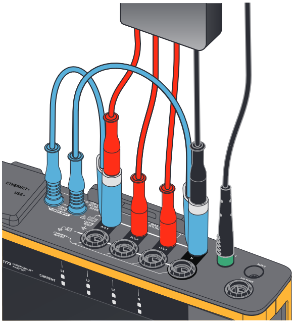
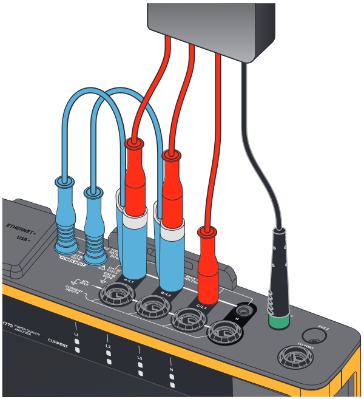
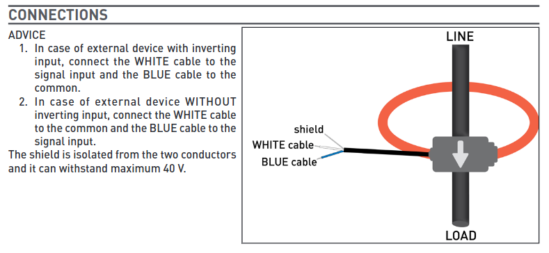
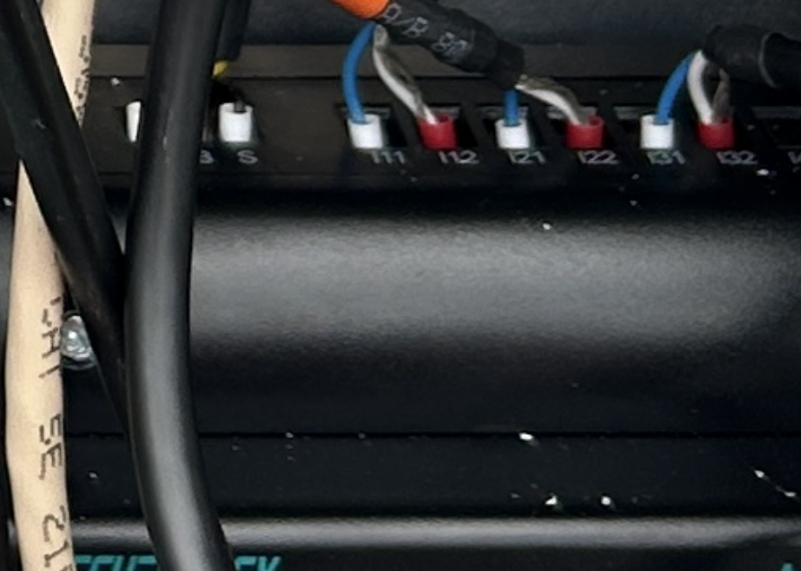
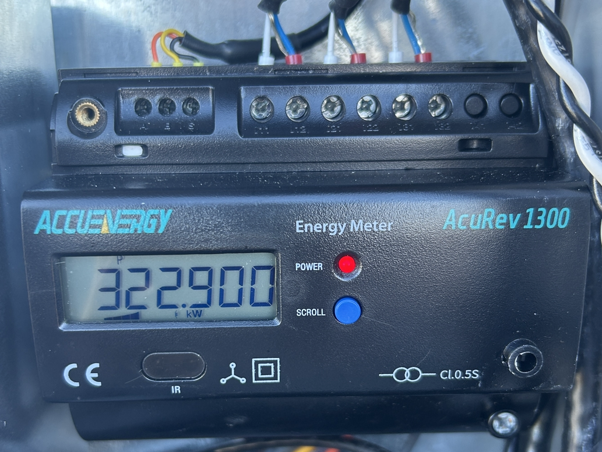
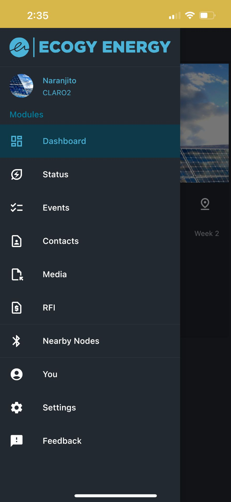
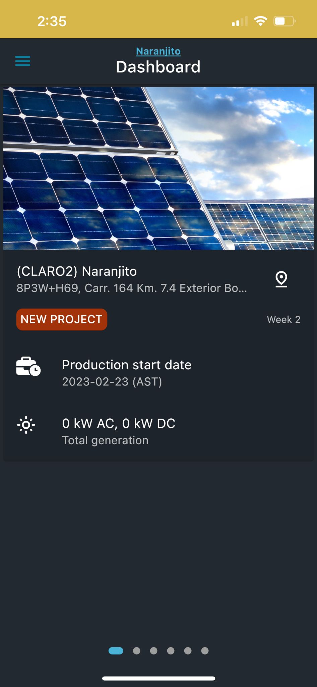
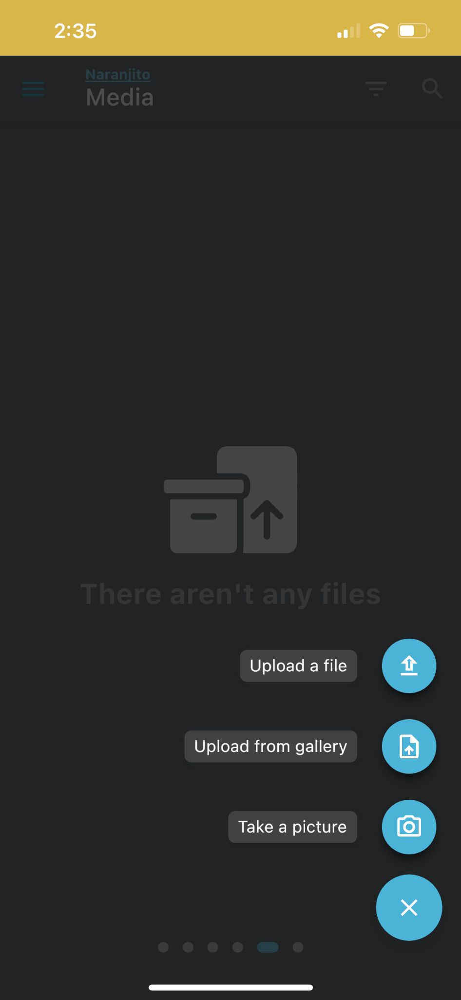

# Install Manual (Consumption)

Edge Compute Node (ECN) Install Manual (Consumption)

v.2024.05.22

Overview:

This document is intended to aid the ECN installer in unboxing and installing consumption monitoring ECNs.

Context:

Before installation can take place, Internet connectivity must be prepared for each node to make sure it can be properly tested as soon as it is correctly installed. If there is an IT contact at the sites, please let them know ahead of time where the node will be located so they can arrange connectivity beforehand.

Relevant Roles for this document:

* EPC as Licensed Electrician
* Field Technician as Licensed Electrician

Resources needed:

* ECN
* Fluke 1773 Power Quality Meter
* Node Wiring Diagram
* Ecosuite Support Kit as necessary (Spare power supplies, a rescue node, extra Modbus, ethernet, colored internal power wiring, a ferruling kit, etc.)
* Extra brown-white shielded wiring for CT extensions
* Ecogy App

Step-by-Step Process:

Step 1: Inspect ECN Contents

Make sure the contents have not been damaged during shipping. If the ECN enclosure or any internal components look damaged, contact Ecosuite immediately. All wiring connections should still be clamped and be able to hold up to a pull test. Take a good picture of the inside of the node, and anything extra that shipped with it. Ecosuite should also ship with a printed color copy of the wiring diagram for reference.

.jpeg>)

_Pre-install ECN with all components present_

Step 2: Install ECN

Mount the ECN within 30 feet of the CT location using the included mounting brackets. The node will need to be wired to the CTs, 3-phase power from the same circuit that the CTs measure, and Ethernet connectivity. When power is connected, there should be activity lights on the Node, the router, and the meter.

|  |  |
| --------------------------------------------------------------------- | -------------------------------------------------------------------- |
| _Mounting brackets_                                                   | _Simplified ECN wiring_                                              |

ECN installations must comply with the National Electrical Code. One specific provision, NEC 110.26, states that "Sufficient access and working space shall be provided and maintained about all electrical equipment to permit ready and safe operation and maintenance of such equipment." This means that the ECN must be installed to have 3 feet of clearance in front of it, and not impede the 3 feet of clearance required for any existing equipment. Please make sure to contact Ecogy to confirm node placement before moving forward with the installation.

.jpeg>)

_NEC 110.26 Requirements_

Step 3: Inspect Power Flow Direction

To make sure the CTs are installed correctly, Phase information and current flow direction should be measured by the Fluke Power Quality Meter. [This is the data sheet from the Fluke website](https://www.fluke-direct.com/pdfs/cache/www.fluke-direct.com/1773-basic/manual/1773-basic-manual.pdf). This data can confirm that we are installing the CTs in the right location, and that phase information matches the labeling on site.

The first thing to do is to connect the Fluke meter voltage references. It is important that the voltages connected to the Fluke meter do not exceed 600V line to line. There are two different cases: 3-phase with neutral, and 3-phase no neutral. Below are the two connection possibilities. The next thing to do is to connect and attach the measurement probes around the conductors to measure. Each probe will be labeled on both ends to make installation easier.

|  |  |  |
| ---------------------------------------------------------------- | ---------------------------------------------------------------- | -------------------------------------------------------------------- |
| _Connect to Line and Neutral_                                    | _Connect from Line to Line_                                      | _CT Identification_                                                  |

Step 4: Install CTs

To get the most accurate power measurements, the CTs must be measuring around the entire load of the building, Including Utility and Generators. The most common CTs in use are 10 ft long, but can be extended as needed to a maximum of 30 ft before noise and low signal strength disrupt the connection. These extensions can be made with two two-conductor shielded cables, joined to the 10ft CT with a ferruling kit. The arrow on the CT should point in the direction of current flow, towards the loads of the building.

CT Extension:

.png>)

|                                                                   |                                                                   |
| ----------------------------------------------------------------- | ----------------------------------------------------------------- |
|  |  |

_CORRECT - Signal Wire on I-12, I-22, and I-23 INCORRECT - Common + Signal Wires Reversed_

Step 4: Verify Data Connectivity and Accuracy 

After the node is wired and connected by Ethernet, it is ready to post power consumption data. Ecogy will verify remote connection to the node and enable data upload to the Ecogy App. Once enabled, consumption data should match the independent measurements of the Fluke meter. (need to revisit with Bluetooth, and add pictures)

Step 5: Verify Node Resiliency

On sites with generator backups, we must make sure that the ECN can handle cold starts after outages, and if possible ATS switchover from grid to generator power and back. This will avoid a situation where a switchover event occurs without a technician on site to correct it.

(generator switchover)

Step 6: Provide Documentation

For our records, please take detailed photographs of the ECN’s wiring, CT direction and mounting location, and external photos of the location if possible! This helps us improve our data dashboard. Photos can be uploaded using the Ecogy app. Navigate to the dashboard of the site, and swipe to the media tab. Here, photos can be taken and uploaded directly to the AMS.

|  |  |  |
| ------------------------------------------------------------------ | ------------------------------------------------------------------ | ------------------------------------------------------------------ |
